# Architecture — ctr-rosales-qc

Hexagonal / Ports & Adapters. Dependencies point inward only. The application pipeline
depends exclusively on domain Ports (Protocols); adapters implement those ports and
lazy-import heavy dependencies. The domain core imports no SDK, framework, or I/O library.

The full design (code snippets + sequence diagrams) is in
`openspec/changes/material-reconciliation/design.md` (base §1–7 + rev-2 delta §A–F).

---

## Hexagonal layer diagram

```mermaid
graph TD
    subgraph Infrastructure
        API[FastAPI\ninfrastructure/api/]
        CONTAINER[container.py\ncomposition root]
    end

    subgraph Adapters
        QR[QrBarcodeExtractionAdapter\nadapters/identity/qr_barcode.py]
        VISION_OAI[OpenAICompatibleVisionAdapter\nadapters/vision/openai_compatible.py]
        VISION_ANT[AnthropicVisionAdapter\nadapters/vision/anthropic_vision.py]
        OLLAMA[OllamaMaterialAdapter\nadapters/inference/ollama_material.py]
        PADDLE[PaddleTableExtractor\nadapters/ocr/paddle_table.py]
        NULL_OCR[NullOcrExtractor\nadapters/ocr/null_extractor.py]
        SUNAT[SunatDescargaqrAdapter\nadapters/sunat/descargaqr.py]
        PDF[PyMuPdfSourceAdapter\nadapters/pdf/pymupdf_source.py]
        REPORT[ExcelReportAdapter\nadapters/report/xlsx_report.py]
    end

    subgraph Ports["Domain Ports (Protocols — domain/ports.py)"]
        P_IDENT[IdentityExtractionPort]
        P_VISION[VisionLLMPort]
        P_INFER[MaterialInferencePort]
        P_OCR[ExtractionPort]
        P_SUNAT[SunatGreFetchPort]
        P_DOC[DocumentSourcePort]
        P_REPORT[ReportPort]
    end

    subgraph Domain["Domain Core (PURE — no SDK/IO)"]
        DOMAIN[models · classifier · reconciliation\nmaterial_key · material_key_normalizer\nmaterial_key_resolver · date_divergence\ndate_inference · section_id_guard\nnormalizer · ports · errors]
    end

    subgraph Application
        PIPELINE[ReconciliationPipeline\napplication/pipeline.py]
        CONFIG[AppConfig\napplication/config.py]
        CTX[RunContext\napplication/run_context.py]
        REVIEW[ReviewService\napplication/review_service.py]
    end

    QR -->|implements| P_IDENT
    VISION_OAI -->|implements| P_VISION
    VISION_ANT -->|implements| P_VISION
    OLLAMA -->|implements| P_INFER
    PADDLE -->|implements| P_OCR
    NULL_OCR -->|implements| P_OCR
    SUNAT -->|implements| P_SUNAT
    PDF -->|implements| P_DOC
    REPORT -->|implements| P_REPORT

    PIPELINE -->|depends on| P_IDENT
    PIPELINE -->|depends on| P_VISION
    PIPELINE -->|depends on| P_INFER
    PIPELINE -->|depends on| P_OCR
    PIPELINE -->|depends on| P_SUNAT
    PIPELINE -->|depends on| P_DOC
    PIPELINE -->|depends on| P_REPORT
    PIPELINE -->|depends on| CONFIG
    PIPELINE -->|depends on| CTX

    P_IDENT --- DOMAIN
    P_VISION --- DOMAIN
    P_INFER --- DOMAIN
    P_OCR --- DOMAIN
    P_SUNAT --- DOMAIN
    P_DOC --- DOMAIN
    P_REPORT --- DOMAIN

    CONTAINER -->|wires| PIPELINE
    API -->|invokes| PIPELINE
    API -->|invokes| REVIEW
```



**Dependency-inversion direction:** `Adapters → Ports ← Application`. Neither adapters
nor the application layer know about each other's concrete types; only the domain Protocols
are the shared contract.

---

## Pipeline stages diagram

```mermaid
flowchart TD
    A[Stage 1: _stage_split\nPDF pages via PyMuPDF] --> B
    B[Stage 1b: _stage_decode_identities\nQR/barcode pre-pass — cache page to DecodeOutcome\npyzbar + zxing-cpp COLOR union] --> C
    C[Stage 2: _stage_classify\nhybrid OR-gate: title text + QR signal\nSectionIdPredicate guards Contents-ID != Registro] --> D
    D[Stage 4: _stage_extract_declared\ndigital text — Notes + Protocolo dedupe] --> E
    E[Stage 5: _stage_extract_ocr\nPaddleOCR tables on guia pages\ndeskew on scanned guias\nocr.enabled=false -> NullOcrExtractor] --> F
    F[Stage 5b: _stage_assemble_blocks\nmulti-page guia blocks, reuse DecodeOutcome cache] --> G
    G[Stage 5c: _stage_sunat_fetch\nopt-in SUNAT descargaqr — OFF by default air-gap\nbounded concurrency fetch_many] --> H
    H[Stage 6: _stage_extract_vision\nhandwritten guia dates via VisionLLMPort\nper-call wall-clock deadline] --> I
    I[Stage 7a: _stage_normalize_dates\nbounded year inference — day/month trusted\nvision year NEVER trusted directly] --> J
    J["Stage 7b: _stage_normalize — R8\nMaterialKeyNormalizer: det-regex -> CanonicalKey\nMaterialKeyResolver: det-first, opt-in LLM fallback, cache\nGrouping key: (registro, material_canonical, unidad)\nfecha is NOT a grouping axis"] --> K

    K[Stage 7c: _stage_extract_declared_date\nhandwritten Protocolo Fecha via VisionLLMPort\nR9 authority — shared cap with guia stage W2-A] --> L
    L["Stage 8: _stage_reconcile\nper-unit EXACT-0 sum -> MATCH / MISMATCH\nworst-wins match_method: unresolved > llm_inferred > deterministic\ncheck_fecha_divergence: day-month strict, year excluded\ndiverges -> requires_review WARNING + page ref + red highlight"] --> M

    M[Stage 9: _stage_persist\nsidecar JSON + vision audit record] --> N
    N[ExcelReportAdapter\nxlsx + csv — 13 cols incl Metodo / Revision / Anio-inferido]

    style J fill:#d4edda,stroke:#28a745
    style L fill:#fff3cd,stroke:#ffc107
```



**R8 invariant** (green): `fecha` is NOT a grouping axis; units are never converted;
MATCH tolerance is EXACT (0).

**R9 side-channel** (amber): fecha-divergence is non-blocking — a diverging guía becomes
a `requires_review` WARNING with page reference and red highlight; never auto-corrected.

---

## Folder layout

```
backend/src/reconciliation/
├── domain/              # PURE — no SDK, framework, or I/O imports
│   ├── models.py            # MaterialLine, GuiaDeRemision, Registro, ReconciliationRow,
│   │                        #   PageClassification, VisionResult, GuiaIdentity,
│   │                        #   GuiaContribution, CanonicalKey, InferenceResult
│   ├── classifier.py        # PageClassifier — classify by TITLE, not supplier name
│   ├── normalizer.py        # MaterialNormalizer — canonicalise description only, never unit
│   ├── material_key.py      # CanonicalKey value-object
│   ├── material_key_normalizer.py  # MaterialKeyNormalizer — deterministic regex (R8)
│   ├── material_key_resolver.py    # MaterialKeyResolver — det-first, opt-in LLM fallback,
│   │                               #   in-process cache (R8)
│   ├── reconciliation.py    # ReconciliationService — per-unit EXACT-0 sum, MATCH/MISMATCH,
│   │                        #   worst-wins match_method aggregation, reassign
│   ├── date_divergence.py   # check_fecha_divergence — pure predicate, day-month only (R9)
│   ├── date_inference.py    # bounded year reconstruction from day/month
│   ├── section_id_guard.py  # SectionIdPredicate — Contents-ID != Registro N° guard
│   ├── ports.py             # Protocols: DocumentSourcePort, ExtractionPort, VisionLLMPort,
│   │                        #   ReportPort, IdentityExtractionPort, MaterialInferencePort,
│   │                        #   SunatGreFetchPort
│   └── errors.py
├── application/         # orchestration; depends on domain ports only
│   ├── config.py            # AppConfig (pydantic-settings); provider selection; ocr.enabled;
│   │                        #   vision cost cap; confidence threshold 0.85; deskew=guia_only
│   ├── run_context.py       # per-run isolated output dir, extraction cache, review.json sidecar
│   ├── pipeline.py          # ReconciliationPipeline — deterministic stage sequence
│   └── review_service.py    # edits + reassignment, sidecar persistence/replay
├── adapters/
│   ├── pdf/                 # PyMuPdfSourceAdapter (read-only), DigitalTextExtractionAdapter
│   ├── ocr/                 # PaddleTableExtractor, NullOcrExtractor (ocr.enabled=false),
│   │                        #   paddle_deskew (DocImgOrientationClassification), _capability
│   ├── vision/              # AnthropicVisionAdapter, OpenAICompatibleVisionAdapter
│   │                        #   (OpenAI cloud + Ollama via base_url), factory
│   ├── inference/           # OllamaMaterialAdapter (MaterialInferencePort), factory
│   ├── identity/            # QrBarcodeExtractionAdapter — pyzbar + zxing-cpp COLOR union,
│   │                        #   deterministic serie-numero guia_id
│   ├── report/              # ExcelReportAdapter (openpyxl, xlsx + csv,
│   │                        #   13 cols incl. Metodo/Revision/Anio-inferido)
│   └── sunat/               # SunatDescargaqrAdapter — opt-in, OFF by default (air-gap)
└── infrastructure/
    ├── container.py         # composition root: CompositeExtractionAdapter,
    │                        #   build_page_to_registro_map, build_pipeline (wires all adapters)
    └── api/                 # FastAPI: main.py (create_app), routes.py, schemas.py

frontend/src/
├── api/            # client.ts + types.ts — mirror backend schemas exactly
├── stores/         # Pinia: run, reconciliation (client state)
├── composables/    # TanStack Query (server state)
├── design/         # tokens.css (industrial QC palette, semantic MATCH/MISMATCH colors)
└── features/
    ├── run/        # UploadPanel, RunProgress
    └── review/     # ReviewGrid, ReconciliationRow, ConfidenceBadge, SourcePages,
                    #   GuiaReassignDialog, ExportButton, ReviewPage
```

---

## Rev-3 domain rules (R8, R9, r10)

### R8 — Canonical material matching

- **`MaterialKeyNormalizer`** applies deterministic regex rules to normalise a raw material
  description to a `CanonicalKey`.
- **`MaterialKeyResolver`** runs deterministic normalisation first; if the result is
  ambiguous and `MaterialInferencePort` is configured, it falls back to a one-shot Ollama
  LLM call with an in-process cache to avoid repeated identical queries.
- **Grouping key** is `(registro, material_canonical, unidad)`. `fecha` is NOT a grouping
  axis — including it split declared/guia groups whenever the vision-read date differed
  (year is vision-unreliable), killing MATCH.
- `match_method` tracks resolution path: `deterministic` | `llm_inferred` | `unresolved`.
  The reconciliation service aggregates across all contributing lines using **worst-wins**
  ordering: `unresolved > llm_inferred > deterministic`.
- Units KG / TN / RD / Rollo are summed independently; never converted.
- MATCH tolerance is EXACT (0); confidence auto-flag threshold is 0.85.

### R9 — Reception-date authority and fecha-divergence

- The **authoritative declared reception date** is the **handwritten `Fecha:` on the
  Protocolo de Recepcion** page, read via `VisionLLMPort.read_handwritten_date`, linked
  to the Registro N°.
- **`_stage_extract_declared_date`** reads this stamp using the same `VisionLLMPort`
  instance and the same shared cost cap as the guia date stage (W2-A: no double-counting).
- **Year reconstruction**: vision year is never trusted directly. `_stage_normalize_dates`
  always reconstructs the year from day/month via bounded inference (`date_inference.py`).
  Declared and guia sides have different lower bounds, so year comparison is excluded from
  divergence checks.
- **`check_fecha_divergence`** (`domain/date_divergence.py`) compares `(month, day)` only
  with tolerance 0. Null on either side yields not-divergent (null-safe: FDR-005/006).
- A diverging guia is a misfiled signal: non-blocking `requires_review` WARNING with page
  reference and red highlight. Never auto-corrected; requires human review and manual reassign.

### r10 — Containerized verification (paddle-free)

- `ocr.enabled = false` activates `NullOcrExtractor` (zero paddle import). SUNAT supplies
  quantities when OCR is disabled.
- `backend/Dockerfile` + `docker-compose.yml` define a paddle-free container for
  cloud-vision verification runs.
- Vision is **provider-agnostic** via `VisionLLMPort`: `anthropic` or any OpenAI-compatible
  endpoint (OpenAI cloud, Ollama local, `qwen3.5:397b-cloud` via `OLLAMA_BASE_URL`).
  Provider selection is config-only; the domain never binds to a vendor.
- Each `VisionLLMPort` call carries a **per-call wall-clock deadline** so a thinking-blowup
  cloud call cannot stall the pipeline.
- The pipeline degrades gracefully at the vision cost cap (leaves `fecha=None` / flags
  `requires_review`); it never raises on cap exhaustion (KI-1 fix, ba3b0c5).
- SUNAT `fetch_many` uses bounded concurrency to avoid throttling.

### rev-2 QR identity tier

- **`QrBarcodeExtractionAdapter`** decodes QR codes using pyzbar + zxing-cpp with a COLOR
  union strategy for reliability.
- The deterministic `serie-numero` from the QR is the canonical `guia_id`.
- **Three identifiers — never confuse them:**
  - Contents-ID `#4252` — PDF section heading
  - Registro N° `232` — business key; group by this
  - QR `serie-numero` — deterministic guia identity
- **`SectionIdPredicate`** (`domain/section_id_guard.py`) guards against treating the
  Contents-ID as a Registro N°.

---

## Key invariants

- Domain imports no SDK or framework (verified at import time).
- Adapters lazy-import heavy deps (`paddleocr`, `anthropic`, `openai`, `pyzbar`,
  `zxing-cpp`) inside methods so the test suite runs without them installed.
- `pipeline.py` imports only domain ports + config/run_context — no concrete adapter
  imports (Dependency Inversion Principle).
- Input PDF is read-only; each run writes its own isolated output directory.
- `fecha` is never a grouping axis. Units are never converted. MATCH tolerance is EXACT 0.
- Vision year is never trusted directly; always reconstructed via bounded inference.

---

## API surface (FastAPI, local-first, base `/api/v1`)

`POST /runs` · `GET /runs/{id}` · `GET /runs/{id}/table` · `PATCH /runs/{id}/rows/{row_id}`
· `POST /runs/{id}/reassign` · `POST /runs/{id}/export` · `GET /runs/{id}/audit`
· guia-line cantidad edit · `GET /runs/{id}/pages/{page}/thumbnail`

---

## How to run

```bash
# Backend — development
cd backend && pip install -e ".[dev]"         # add [ml] / [llm] for OCR / vision adapters
python -m pytest -q                            # 886 targeted unit tests
uvicorn reconciliation.infrastructure.api.main:app --host 127.0.0.1 --port 8000 --reload

# Backend — paddle-free containerized verification (r10)
# Requires OLLAMA_BASE_URL and OLLAMA_MODEL env vars (or defaults in docker-compose.yml)
make verify-container                          # or: docker compose run --rm backend ...

# Frontend
cd frontend && npm install
npm run test:unit                              # 188 vitest tests
npm run dev                                    # Vite dev server (proxies /api to :8000)
```

### Config escape hatches

| Key | Effect |
|-----|--------|
| `ocr.enabled = false` | Activates `NullOcrExtractor`; zero paddle import; SUNAT supplies quantities |
| `vision.provider = ollama` | Routes `VisionLLMPort` to `OpenAICompatibleVisionAdapter` with local Ollama |
| `vision.provider = anthropic` | Routes `VisionLLMPort` to `AnthropicVisionAdapter` |
| `sunat.enabled = false` (default) | Keeps air-gap; SUNAT fetch disabled |
| `vision.max_vision_calls` | Cost cap; pipeline degrades gracefully at cap, never raises |
